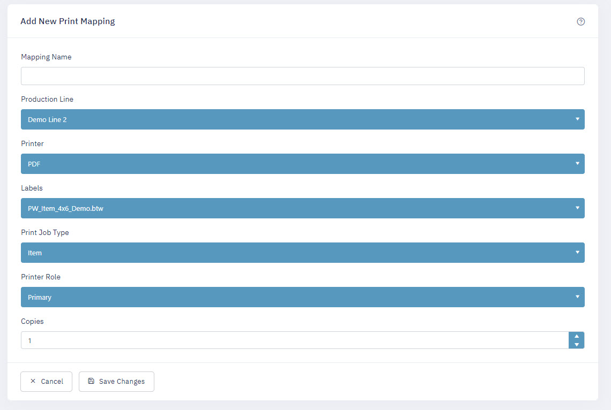

After installation, a PalletWorks Administrator should go through the process of setting up the enviroment in preparation for Orders.

### Production Lines

Start by hitting "Add Production Line" to set up a line to run Orders on. 

| Field | Comment |
| ---------- | ---------------------------|
| Name | Enter a name for your production line |
| Location | Optional field for specifying a location with your production area |
| PLC Line # | This number must match the PLC LineNum value running on the PLC for that line. This connects data to a physical line. |

### Containers

Next, ensure that you have containers properly set up for your Products to use. Select "Add New Container" to add a new container.

| Field | Comment |
| ---------- | ---------------------------|
| Container Name | Enter a name for your container |
| TareWeight | Enter the tare weight of your container. This will be used for calculating Net Weight on items created. |

### Products

Next, add a Product record for each product you will be producing on your line. Select "Add New Product" to add a new record.

| Field | Comment |
| ---------- | ---------------------------|
| Name | Enter the name of your product |
| Description | Enter a product description |
| Container Type | Select from your previously entered containers to associate a Product to a known container type |
| GTIN | Enter the GTIN for this product | 
| LabelData1 | Optional field for product specific information | 
| LabelData2 | Optional field for product specific information | 
| MinWeight | Optional minimum acceptable weight for product. Can optionally trigger reject if outside of range. | 
| MaxWeight | Optional maximum acceptable weight for product. Can optionally trigger reject if outside of range. | 
| FullPalletQuantity | Optional value to record how many quantities of this item can fit on your pallet. Used for detecting when a pallet is full. |
| FullPalletQuantityUOM | Unit of Measure to indicate when a pallet is full, eg. ea, lbs, etc. |
| SampleInterval | Optional field to specify the interval that a Product should be marked as a Sample | 

> Note: All of this information is available to be optionally be printed on your Item Label

### Print Mappings

Lastly, set up the Print Mappings. This matches print jobs coming in from a production line to a specific printer, by job role.

Select "Add Print Mapping" to add a new mapping.

| Field | Comment |
| ---------- | ---------------------------|
| Production Line | Select a production line that was previously added |
| Printer | Select a printer as set up from your print provider |
| Labels | Select a label available from your print provider |
| Print Job Type | Select "Item" or "Pallet" to specify the label type | 
| Printer Role | Select a printer role. "Primary" will print a standard label. "Secondary" would be used for automatic failover when primary fails. "Re-Print" is used specifically for off-the-line label reprints. "Rejected" would be used for specifically printing a reject label, or from a reject station.  | 

