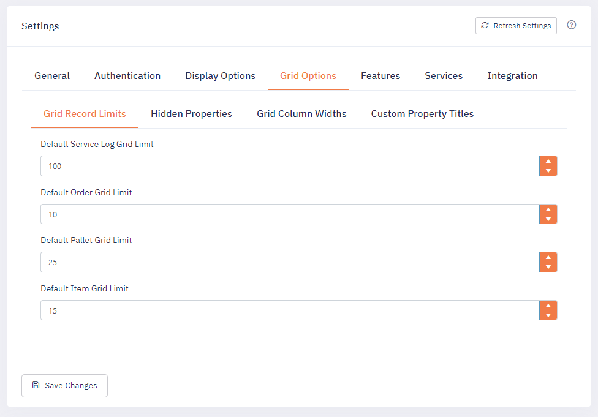

During installation, PalletWorks offers several optional features to be enabled dependent upon the manufacturing line's requirements. You can see which options are enabled in the Portal Settings page. Below is a list of optional settings configured upon installation:

## General
The PalletWorks instance client Id, service Id, and portal Url

## Authentication 
Authentication settings and security group management. 

## Display Options

### DefaultOrderDateOffset

This sets the default view of Orders filtered by a date offset. To see yesterday's orders by default, use "-1" as a value. To use the current date, use "0" as the value in this setting. To view all orders by default, keep this value of null.

### Enable HMI Scroll Buttons

When enabled, this will display scroll buttons in the top header of the portal. This is to give operators another option for scrolling up and down a page.

## Grid Options

Within PalletWorks, there are three main grids that display information: Orders, Pallets and Items. The columns visible and what the titles are called can all be customized through the settings. 

### Grid Record Limits
Sets the default limit of records returned for a page grid. 

### Entity Property Hidden
Contains a list of columns and fields to be hidden, both within a grid and on the detail pages as well: 
 
Example: Product.LabelData2

### Grid Column Widths
 Column widths can be set to a specific integer value to display the desired layout:
  
 Example: Product.Name 150

### Custom Property Titles
Contains a list of overwriting the default title names with a custom title: 
 
Example: Product.LabelData1 = Allergy Statement

## Features

### EnableOverrides

This option will allow the Product Id and/or Best By Date of items produced on a line to be overridden at the Production Line level. While this feature is active, any items produced on the line will use the values set in the Overrides section instead of the default Order values.

### EnableProductLabels

This feature allows labels to be customized by Product Ids/SKU. By default, all products will use the same label template and dynamically replace the text within the label for the product. Enabling this feature, allows a per-product label template to be utilized.

### Enable Item Tracking

This feature will allow the tracking of items on pallets. By default Item tracking is enabled.  For customers that only track pallet data, this feature can be disabled. 

### Units of Measure

This is the list of units of measure for products, items, and labels. By default ea (each) is required. Units of Measure settings are used for the Product Weight and Full Pallet Quantity on products.

### QC Reason Codes

This list allows for reason codes to be added to QC'ed Orders, Items, and Pallets. This feature can help customers track trends for quality control issues, or recalls. These codes can be synced with an ERP if enabled.

## Services
This is a list of Rest API URLs for all of PalletWorks connected services. 

## Integration 

### Integration Enabled

When this option is enabled, it allows data created within PalletWorks to be submitted to an external ERP system. PalletWorks supports any modern ERP system that offers web-based REST or SOAP connectivity. When this option is disabled, there will be no data transmitted outside of the PalletWorks product.

This section also will list out any required Integration API Endpoints. 