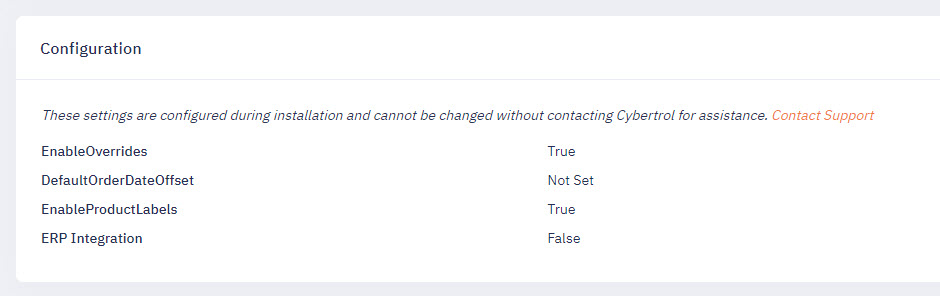

During installation, PalletWorks offers several optional features to be enabled dependent upon the manufacturing line's requirements. You can see which options are enabled in the Portal Settings page. Below is a list of optional settings configured upon installation:



### PrintProvider

PalletWorks is designed to primarily work with the printing solution: Bartender 2022 Automation Edition. This option will allow future integration with other printing solutions via API once available. 

### ERPEnabled

When this option is enabled, it allows data created within PalletWorks to be submitted to an external ERP system. PalletWorks supports any modern ERP system that offers web-based REST or SOAP connectivity. When this option is disabled, there will be no data transmitted outside of the PalletWorks product.

### EnableAutoSendToERP

This option will enable whether completed Orders should automatically send to the ERP system the collected data, or allow a manual review by an operator before submitting newly created inventory.

### EnableOverrides

This option will allow the Product Id and/or Best By Date of items produced on a line to be overridden at the Production Line level. While this feature is active, any items produced on the line will use the values set in the Overrides section instead of the default Order values.

### DefaultOrderDateOffset

This sets the default view of Orders filtered by a date offset. To see yesterday's orders by default, use "-1" as a value. To use the current date, use "0" as the value in this setting. To view all orders by default, keep this value of null.

### EnableProductLabels

This feature allows labels to be customized by Product Ids/SKU. By default, all products will use the same label template and dynamically replace the text within the label for the product. Enabling this feature, allows a per-product label template to be utilized.

## Customizing Table Columns

Within PalletWorks, there are three main grids that display information: Orders, Pallets and Items. The columns visible and what the titles are called can all be customized through the `appsettings.json` file.

### CustomPropertyTitles
Contains a list of overwriting the default title names with a custom title: 
```json
"Product.LabelData1": "Allergy Statement",
```

### EntityPropertyHidden
Contains a list of columns and fields to be hidden, both within a grid and on the detail pages as well: 
```json
 "Product.LabelData2": "true",
 ```

### GridColumnWidths
 Column widths can be set to a specific integer value to display the desired layout:
 ```json
 "Order.ProductName": 150
 ```

During installation, a technician will review all the options and set up the customized values as desired to customize the Portal's views.