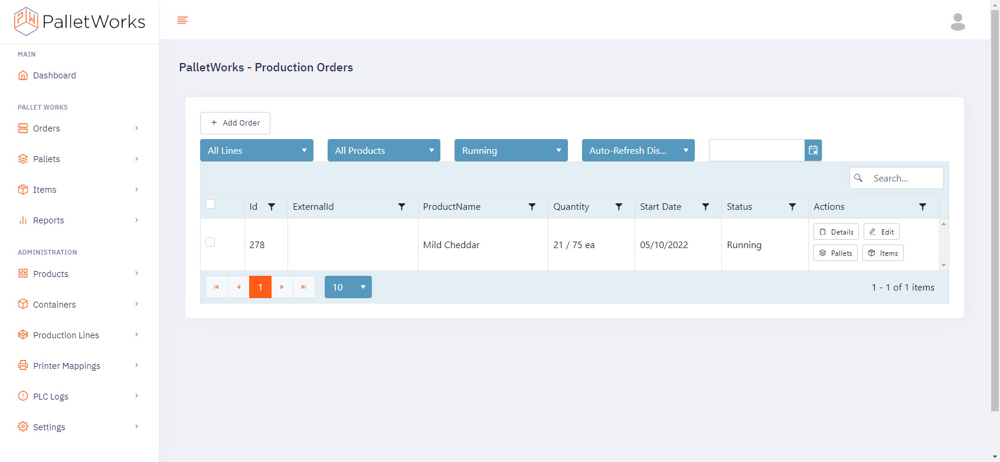
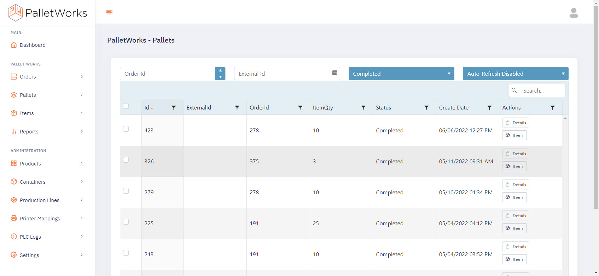
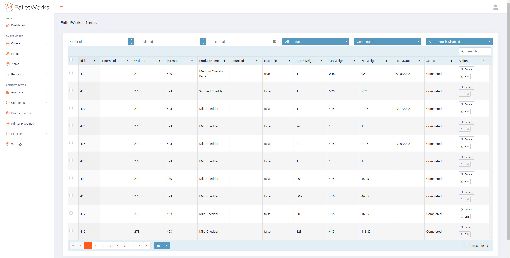

Once you are logged into the Portal, use the main navigation menu on the left to access the PalletWorks features. Administrative functions are locked down to users with admin access, setup at the time of installation. 

### Orders

The Orders page contains a grid of all the Orders within the PalletWorks system. Use the dropdowns to filter your view. Filtered views can be bookmarked. Use the Auto-Refresh option to automatically refresh the grid to see live production data as it is created. Bulk Updates are available if at least one Order checkbox is selected. The Pallets button will redirect you to the Pallets page, and auto-filter the Pallets grid to any Pallets associated with the Order you selected the action in. Order Items can be viewed with the same method.

### Pallets

The Pallets page contains a grid of all the Pallets within the PalletWorks system. Use the dropdowns to filter your view. Filtered views can be bookmarked. Use the Auto-Refresh option to automatically refresh the grid to see live production data as it is created. Bulk Updates are available if at least one Pallet checkbox is selected. The Items button will redirect you to the Items page, and auto-filter the Items grid to any Items associated with the Pallet you selected the action in. 

### Items

The Items page contains a grid of all the Items within the PalletWorks system. Use the dropdowns to filter your view. Filtered views can be bookmarked. Use the Auto-Refresh option to automatically refresh the grid to see live production data as it is created. Bulk Updates are available if at least one Item checkbox is selected. 

