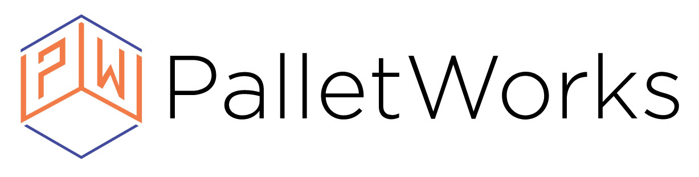

## Welcome

Welcome to the PalletWorks User Guide. 

## About PalletWorks

PalletWorks is an intelligent bridge between the manufactering floor and the ERP system. Primary interaction with the product is conducted through the web-based Portal. The URL used to access the portal is configured upon installation. The portal works best using a personal computer running Chrome v100 (or later) or Edge v102 (or later), or through the industrial tablet provided at the time of installation.