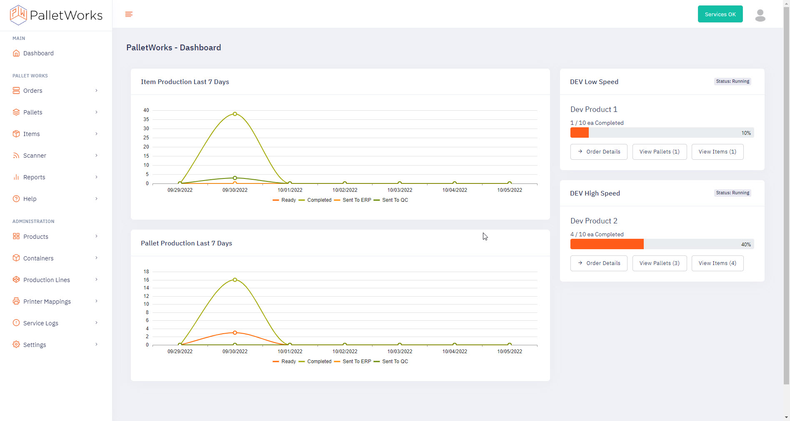

## Welcome

Welcome to the PalletWorks User Guide. This user guide is intended for end users and operators using PalletWorks in a manufacturing environment.

## About PalletWorks

PalletWorks is a software product that acts as an intelligent bridge between the manufacturing floor and the ERP system. PalletWorks records and labels items and pallets coming off a production line and helps ensure accurate production data is recorded. Primary interaction with the product is conducted through the web-based Portal. The URL used to access the portal is configured upon installation. The portal works best using a personal computer running Chrome v100 (or later), or Edge v102 (or later), or through the industrial tablet provided at the time of installation. 