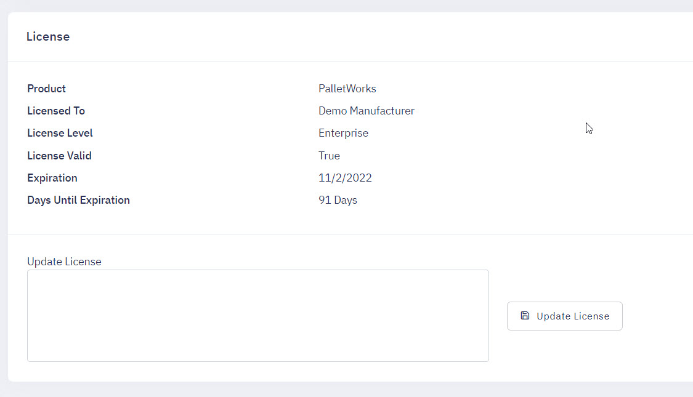

PalletWorks offers three different pricing levels: Basic, Pro and Enterprise. Below is a chart of features offered for each level:

### Main Features

| Feature | Basic | Pro | Enterprise |
| ------------- |:-------------:|:-------------:|:-------------:|
| Tracks Items Created by Unique Identifier | &#9745; | &#9745; | &#9745; |
| Tracks Items Stacked on Pallets | &#9745; | &#9745; | &#9745; |
| Tracks Pallets by Unique Identifier | &#9745; | &#9745; | &#9745; |
| Hand Scanner Compatibility | &#9745; | &#9745; | &#9745; |
| Verify Labels are Printed and Applied Correctly  | &#9744; | &#9745; | &#9745; |

### Labels

| Feature | Basic | Pro | Enterprise |
| ------------- |:-------------:|:-------------:|:-------------:|
| Basic Labels | &#9745; | &#9745; | &#9745; |
| Customized Labels | &#9744; | &#9745; | &#9745; |
| Customized Labels by Product | &#9744; | &#9744; | &#9745; |

### Optional Features

| Feature | Basic | Pro | Enterprise |
| ------------- |:-------------:|:-------------:|:-------------:|
| Automatically Print Pallet Labels | &#9745; | &#9745; | &#9745; |
| Sequence Items Created | &#9745; | &#9745; | &#9745; |
| Automatic Order Switching | &#9744; | &#9745; | &#9745; |
| Upstream Printing | &#9744; | &#9745; | &#9745; |
| Sample Tagging | &#9744; | &#9744; | &#9745; |
| Override Active Order | &#9744; | &#9744; | &#9745; |
| Multiple Orders Active | &#9744; | &#9744; | &#9745; |
| High Speed Line Compatibility | &#9744; | &#9744; | &#9745; |

### Integrations

| Feature | Basic | Pro | Enterprise |
| ------------- |:-------------:|:-------------:|:-------------:|
| REST API Endpoints | &#9745; | &#9745; | &#9745; |
| PLC/HMI Integration | &#9744; | &#9745; | &#9745; |
| Customized ERP Integration | &#9744; | &#9745; | &#9745; |

### Security

| Feature | Basic | Pro | Enterprise |
| ------------- |:-------------:|:-------------:|:-------------:|
| Basic Logins | &#9745; | &#9745; | &#9745; |
| Docker Containers with Kubernetes Support | &#9745; | &#9745; | &#9745; |
| Active Directory Authentication | &#9744; | &#9745; | &#9745; |

### Support

| Feature | Basic | Pro | Enterprise |
| ------------- |:-------------:|:-------------:|:-------------:|
| Extensive Logging for Troubleshooting | &#9745; | &#9745; | &#9745; |
| Direct Remote Support Visibility | &#9744; | &#9745; | &#9745; | 

## Updating License

PalletWorks requires an active license to maintain all available features for your license level. When your license is within 30 days of renewal you will receive an warning prompt on the dashboard to contact Cybertrol for renewal. Once your license is purchased you will be emailed an encrypted license key that you can place into the Portal. Only PalletWorks administrators have permission to view the Settings page.

To update your license, log into the PalletWorks portal, and select the Settings menu. 

Enter your new license key into the Update License box, and select the Update License button. Once your license is updated, your new renewal date should be visible.