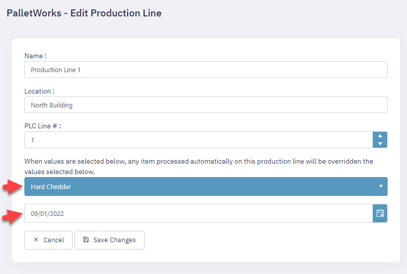
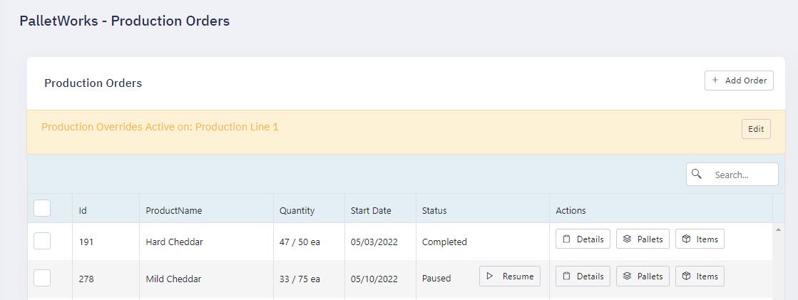
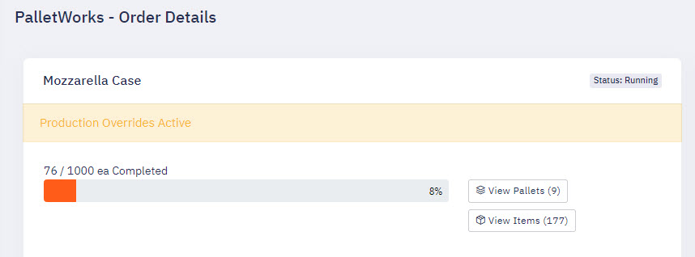
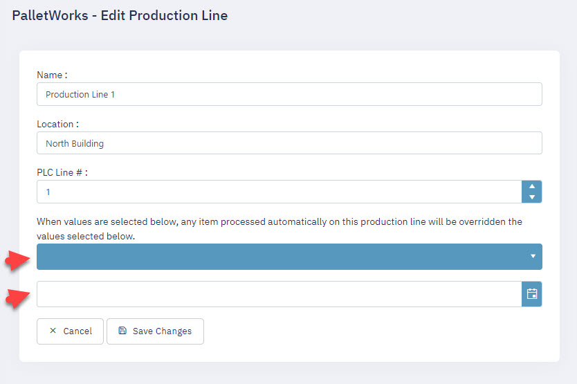
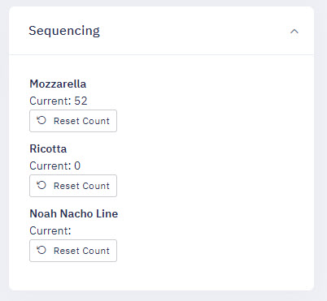
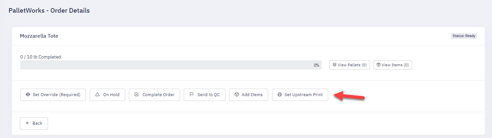

### Start of Day Procedures

At the beginning of your production day, at least one Order must be added and marked as Running, so that the system knows which Order information to associate newly created Items to. Orders can be manually added through the Portal, or automatically added through an optionally included Integration service. When an Order has been filled, depending on the EnableAutoOrderSwitching toggle, it will be marked as Completed, send to ERP, and can also automatically start the next Order in the queue. This allows for a manufacturing line to continue a steady stream of production, and allow multiple Orders to be filled, labeled, and verified automatically.

### Setting Best By Dates

When creating an Order, either through the Portal or automatically through an ERP Integration Service, an optional field to set the Best By date is available for all Items created in that Order. If that value is not specified, the Item create step will check for an optional field in that Product called Best By Interval, where it will take the current date and add x amount of days based on the Offset value. If no value exists for either, then no Best By date will be added to the Item record.

### Switching Orders

Switching which Order is active works differently depending on the "EnableMultipleActiveOrders" switch. 

If this switch is enabled, then you must individually start and stop each Order in the details page one at a time, and the system will only allow one unique Product code running at a time on each line. 

If "EnableMultipleActiveOrders" is disabled (the default), then only one Order will be allowed to be active at a time for the entire Production Line. In this mode, when you start and Order, it will auto-pause any currently running Order on that production line.

### Units of Measure

During installation of PalletWorks, allowed units of measure will be set and populate in the Product edit page "FullPalletQuantityUOM" dropdown. This sets the unit of measure of any items created with this Product record. If the unit of measure is set to "ea", then item quantities and order fulfillment totals will be used by counting units created and stacked in that Order. If the unit of measure is set to any other value such as "lbs" or "kgs", then Order totals will be calculated from the Net weight of all items created and stacked in that Order.

### Filtering Views

The dropdown filters that on the Order, Pallet and Item pages are included to help you customize a view that best suits your operator needs. When you make selections to a dropdown, such as Production Line or Status, it will re-load the page with those filters selected so that you can bookmark that view into your Favorites. This allows you to quickly access views that best suit your needs.

### Correcting Data

When you need to correct data, the best tool is to use the Bulk Update feature, which is visible after selecting an Order, Pallet or Item from the list. After you select at least one item checkbox, the Bulk Update button will display next to the dropdowns on top of the grid. On the Bulk Update page, it will display a grid showing you the items you selected, and present action options that are available for those items. The following Bulk Update actions are available:

<b>Orders</b>
<ul>
    <li>Change Status to On Hold</li>
    <li>Change Status to Ready</li>
    <li>Change Status to Paused</li>
    <li>Changed Status Completed</li>
    <li>Send to Quality Control</li>
    <li>Send to ERP</li>
</ul>

<b>Pallets</b>
<ul>
    <li>Changed Status Completed</li>
    <li>Change Order</li>
    <li>Reprint Pallet Label</li>
    <li>Send to Quality Control</li>
    <li>Send to ERP</li>
</ul>
> Note: If an action also affects any associated Items, a warning will display.

<b>Items</b>
<ul>
    <li>Changed Status Completed</li>
    <li>Change Product</li>
    <li>Change Pallet</li>
    <li>Reprint Item Label</i>
    <li>Send to Quality Control</li>
    <li>Send to ERP</li>
</ul>

### Managing the Manufactured Date

On the Order edit page, you have the option to manually adjust the Manufactured Date that will be printed onto the labels. Adjust as needed.

### Overrides

An optional feature is the ability to "override" the Product Id/Name and Best By date of the currently running order. This feature can be enabled per manufacturing line. The use case is for manufacturers who are processing and fulfilling a main order, but deviate from that order temporarily to fill another product type or divert towards a separate process. This feature can enabled and disabled as needed within the Portal.

To enable, first a production line overrides must be set. Select the values desired to cause any items created on your production line to use those values:

Products can also be set to require an override to be set before they can be started:

Once an override is active, it will be visible on the Orders page:

It will also show as active on the Order details page:

To de-active, simply clear the values of the overrides on the Production Line page:

### Sequencing

The sequencing feature allows for newly created items to have an auto-incrementing number be added as a property of your item. This feature is used for when you want to track or print on a label the sequence of items created on your production line for that given production run or day. This data can also be pushed to a pallet label to include the item numbers on that production run that have been added to that pallet. (Example: Items 24-32 On Pallet)

Operators can reset the sequence by line by using the Sequencing box on the Orders page.

> Note: Manually adding items through the Add Items button on the Orders page will NOT auto-increment the sequence number. Sequence numbers are only assigned through automated proccesses.

### Upstream Printing

The Upstream printing feature allows you to set a Best By Date on a printer "up stream" from the PalletWorks process. The common use-case is for sending a print job to an ink printer that sprays the Best By date on a product before it is registered as a new product within the PalletWorks system.

If this feature is enabled, Upstream printing commands are sent at the start of an Order automatically, or can be manually sent via the action button on the Order details page prior to starting an Order.

> Note: Upstream printing also requires a Print Mapping be configured with the "Upstream" role prior to starting any Order.