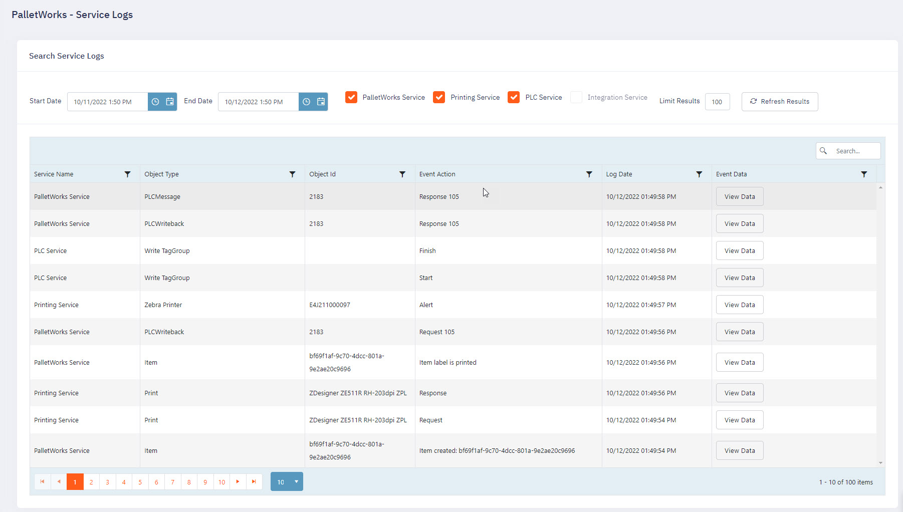

PalletWorks services aggregate logging and events through the Logging service page, available from the main menu called "Service Logs".

From this page, you can view all logged events, filter down a date and time range, or select specific services to view events from. If a service is grayed out, it means it is not available in your installation.

Next to each item is a "View Data" button, which can help technical support diagnose issues you may be encountering.